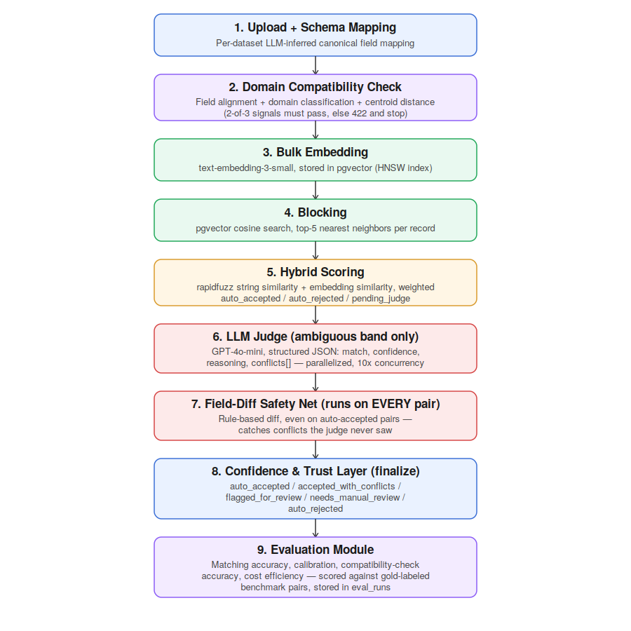

# Concord

A generic entity matching and conflict detection system. Upload two
datasets, and it matches records across them, flags where they disagree,
and reports a confidence level, instead of silently merging data that
should not be merged.

**Live app:** [https://concord-lively-dust-467.fly.dev/](https://concord-lively-dust-467.fly.dev/)

---

## Table of contents

- [Problem statement](#problem-statement)
- [Architecture](#architecture)
- [How it works](#how-it-works)
- [Tech stack](#tech-stack)
- [Core design principle](#core-design-principle)
- [Results](#results)
- [Engineering decisions and tradeoffs](#engineering-decisions-and-tradeoffs)
- [Limitations](#limitations)
- [Future scope](#future-scope)
- [Data model](#data-model)
- [Running locally](#running-locally)

---

## Problem statement

In any real organization, data about the same real world entity often
lives in more than one system, in different shapes, and it does not
always agree. A product catalog might live in an ERP and a storefront
export. A customer record might exist in a CRM and a support tool. Two
sources rarely use the same field names, and their values sometimes
conflict.

Merging this data correctly requires answering three separate questions,
not one:

1. Are these two records even describing the same real world thing.
2. If so, where do they disagree, and how serious is the disagreement.
3. How confident should the system be in its own answer.

Concord is a generic pipeline built around those three questions. It is
not tuned to one dataset or domain. It was validated against two
structurally different real world benchmarks (e-commerce product
listings and academic paper citations) to confirm the design
generalizes rather than overfits to one shape of data.

---

## Architecture



---

## How it works

| Stage | What happens |
|---|---|
| 1. Upload and schema mapping | Each dataset is uploaded independently. An LLM infers a canonical field mapping from that file's headers and sample rows. Mapping happens per dataset, not jointly, so the system stays generic across arbitrary schemas. |
| 2. Domain compatibility check | Before any expensive work runs, three signals decide whether the two datasets are even plausibly related: field alignment (embedding similarity on field name plus sample values), domain classification (an LLM call per dataset, compared by embedding similarity), and centroid distance (average embedding similarity across a sample of each dataset). Two of three signals must agree, or the request is rejected with a clear reason. |
| 3. Bulk embedding | Every record's canonical fields are embedded with `text-embedding-3-small` and stored in Postgres via pgvector. |
| 4. Blocking | For each record in dataset A, pgvector's HNSW index finds the top-5 nearest neighbors in dataset B, avoiding a full cross join between the two datasets. |
| 5. Hybrid scoring | A cheap score combining string similarity (rapidfuzz) and embedding similarity decides the easy cases directly. Confidently similar pairs are auto-accepted, confidently different pairs are auto-rejected, and only the ambiguous middle proceeds to the next stage. |
| 6. LLM judge | GPT-4o-mini reasons about the ambiguous pairs only, returning a structured verdict: match or not, a confidence level, a plain language reason, and a list of specific field level conflicts. Calls run concurrently for speed. |
| 7. Field diff safety net | A rule based check runs on every pair, including ones the LLM judge never saw. This exists because a bug was found during testing where high confidence auto-accepted pairs skipped conflict detection entirely. This stage closes that gap. |
| 8. Confidence and trust layer | Every pair receives a final status: auto accepted, accepted with conflicts, flagged for review, needs manual review, or auto rejected. |
| 9. Evaluation module | Every run is scored against labeled benchmark data: matching accuracy, confidence calibration, compatibility check accuracy, and cost efficiency, all stored for comparison across runs. |

---

## Tech stack

| Layer | Choice | Reason |
|---|---|---|
| Backend | FastAPI | The project is intentionally backend heavy. The API and pipeline are the actual deliverable, not the UI. |
| Embeddings | OpenAI `text-embedding-3-small` | Cheap, fast, and accurate enough for similarity and blocking. |
| Database and vector search | Postgres with pgvector, hosted on Supabase | One database backs both relational state and vector search, which keeps operations simple with no extra system to run. |
| Matching judge | GPT-4o-mini, structured JSON output | A cost conscious choice for a bounded, structured reasoning task, not a free form generation task. |
| String similarity | rapidfuzz | A cheap first pass signal that needs no API call. |
| Frontend | Plain HTML, CSS, and JavaScript, no framework | A deliberate choice to keep the project backend heavy rather than spend effort on UI polish. |
| Deployment | Docker on Fly.io | Single container, connected to Supabase over its IPv4 connection pooler. |

---

## Core design principle

The system is built around one rule applied at every layer: never let a
missing or weak signal look like a real answer.

If a compatibility signal cannot be computed reliably, it is marked as
insufficient rather than silently treated as a pass or fail. If the
string similarity component has no usable field alignment to work from,
it reports that explicitly rather than quietly returning a zero that
looks like a confident rejection. If a pair is confident enough to skip
the LLM judge, it still passes through a separate rule based check
before being called conflict free. Confidence is treated as something
that has to be earned and verified, not assumed.

---

## Results

Both benchmarks below used a stratified sample of 150 known matching
pairs plus 150 known non matching pairs, evaluated against gold labeled
data.

| Metric | Amazon-Google (products) | DBLP-ACM (academic papers) |
|---|---|---|
| Precision | 0.74 | 1.00 |
| Recall | 0.95 | 0.64 |
| F1 score | 0.83 | 0.78 |
| High confidence accuracy | 92.3% | 92.4% |
| Percent escalated to LLM judge | 92.8% | 94.4% |

Compatibility check accuracy: 4 out of 4 on a labeled test matrix that
included two genuinely compatible dataset pairs, one deliberately
incompatible pair (products versus restaurants), and one real benchmark
pair.

**Why two different benchmarks matter here.** A single dataset result
can hide overfitting. Testing on two structurally different domains
surfaced two different failure modes rather than one repeated number.
Amazon-Google trades some precision for high recall, meaning it finds
almost every true match but accepts some false positives along the way.
DBLP-ACM does the opposite, with zero false positives but a lower
recall. High confidence accuracy stayed nearly identical across both
domains (92.3% versus 92.4%), which suggests the judge's core
reliability is stable, while its decision threshold for what counts as
a match shifts based on the kind of data it is looking at.

---

## Engineering decisions and tradeoffs

| Decision | Reasoning | Tradeoff accepted |
|---|---|---|
| Schema mapping is inferred per dataset independently, then aligned at match time | Keeps the system generic. No assumption is made about the domain ahead of time. | Requires an extra alignment step at match time, since two datasets rarely land on identical canonical field names. |
| Compatibility check requires 2 of 3 signals to agree | No single signal is fully trusted. Domain labels and small samples can be noisy. | The check can occasionally pass on a weaker signal combination rather than requiring unanimous agreement. |
| Hybrid score resolves easy cases before any LLM call | Keeps cost and latency low for the majority of clearly similar or clearly different pairs. | On messier real data, the LLM judge still gets used for the majority of pairs, since the cheap signal alone is not always strong enough to decide. |
| A rule based field diff check runs on every pair, not only judged ones | Closes a real gap found during testing, where high confidence matches skipped conflict detection entirely. | Adds one more processing step to every pair, even ones that already look confident. |
| Evaluation uses a stratified sample rather than the full benchmark dataset | A full scale run against the complete benchmark would cost far more in API calls for a portfolio scale project, without adding proportional value. | Results are statistically meaningful but not exhaustive across the entire benchmark. |
| The LLM judge was made explicitly lenient about price and manufacturer differences | This fixed a major recall problem, where the judge was treating expected cross retailer differences as disqualifying. | Precision dropped as a result, and the confidence distribution became less varied, since the judge became more decisive overall. |

---

## Limitations

- The field overlap signal inside the compatibility check is the
  noisiest of its three signals, since it depends on which records get
  randomly sampled.
- The LLM judge's behavior is domain dependent. The precision and recall
  balance seen on product data does not transfer directly to academic
  paper data, since the kinds of "acceptable difference" are different
  in each domain.
- Confidence calibration lost some of its granularity after the recall
  fix. Almost all judged pairs now report high confidence, so the medium
  and low confidence buckets are no longer statistically meaningful.
- Conflict type accuracy, meaning whether the system correctly labels
  why two records disagree, was not formally measured. It would require
  hand labeled data that was intentionally left out of scope.
- Rate limiting is in memory, so it would not hold up correctly across
  more than one running instance.

---

## Future scope

- Build a hand labeled conflict type accuracy evaluation.
- Make the judge's leniency domain aware instead of tuned toward
  e-commerce style data specifically.
- Add a human in the loop review interface for pairs that are flagged
  for review or need manual review.
- Run full scale, non sampled benchmark evaluations for more
  statistically complete numbers.
- Redesign the confidence tiers so that "medium confidence" is
  meaningful again even with the more lenient judge prompt.
- Move rate limiting to a shared store so the system can run across more
  than one instance.

---

## Data model

```
datasets      raw upload plus the inferred schema mapping
records       raw_json (untouched) and canonical_json (remapped), plus embedding
match_jobs    status, compatibility_check result, string_similarity_available flag
matches       blocking_score, hybrid_score, llm_verdict, final_status
conflicts     field_name, value_a, value_b, conflict_type
eval_runs     eval_type, dataset_pair_name, metrics
```

Postgres with the pgvector extension, hosted on Supabase.

---

## Running locally

```bash
git clone <this repo>
cd concord

# Environment variables needed in .env
# DATABASE_URL=postgresql://...   (Supabase connection pooler string)
# OPENAI_API_KEY=sk-...

pip install -r requirements.txt
uvicorn app.main:app --reload
```

Then open `http://localhost:8000` and either upload two CSV or JSON
files, or use the built in sample dataset button to run the full
pipeline end to end against real benchmark data.
